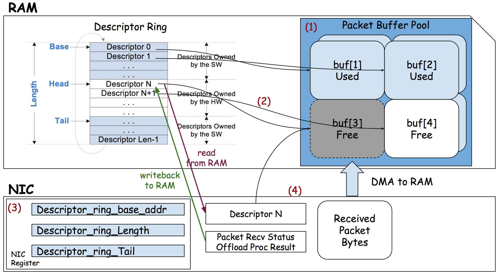

# Networking 
在本次实验中我们需要自己去实现网卡驱动和网络套接字，在写网卡驱动前我们需要知道网卡收发包的工作原理，再看了文档和查阅了一些资料之后总结了一下。
  
  

由这张图我们可以梳理下关于网卡收发包的细节，首先内核需要分配 `rx_ring` 和 `tx_ring` 两块环形缓冲区的内存用来接收和发送报文。其中以太网控制器的寄存器记录了关于 `rx_ring` 和 `tx_ring` 的详细信息。接收 packet 的细节如下：
1. 内核首先在主存中分配内存缓冲区和环形缓冲区，并由 CPU 将 `rx_ring` 的详细信息写入以太网控制器
2. 随后 NIC (Network Interface Card) 通过 DMA 获取到下一个可以写入的缓冲区的地址，当 packet 从硬件收到的时候外设通过 DMA 的方式写入对应的内存地址中
3. 当写入内存地址后，硬件将会向 CPU 发生中断，操作系统检测到中断后会调用网卡的异常处理函数
4. 异常处理函数可以通过由以太网控制寄存器映射到操作系统上的内存地址访问寄存器获取到下一个收到但未处理的 packet 的描述符，根据该描述符可以找到对应的缓冲区地址进行读取并传输给上层协议。  
  
  
  
由这张图可以看出软硬件在接收到 packet 的时候是如何工作的，首先硬件通过 DMA 拿到了 `Head` 所在 `rx_ring` 描述符的内存地址，并获取到其缓冲区地址，然后将收到的 packet 通过 DMA 拷贝到内存中，随后更新 `rx_ring` 描述符的内容并向寄存器中写入 `HEAD` 的新位置，随后向操作系统发出中断，操作系统收到中断通过获取 `Tail` 所在位置的文件描述符的信息来获取下一个将要处理的 packet，处理后由软件而非硬件更新 `Tail` 的位置。  
  
所以我们可以按照以下逻辑写一下网卡收包与发包的过程：
```c
int
e1000_transmit(struct mbuf *m)
{
  //
  // Your code here.
  //
  // the mbuf contains an ethernet frame; program it into
  // the TX descriptor ring so that the e1000 sends it. Stash
  // a pointer so that it can be freed after sending.
  //
  // 获取 ring position
  uint64 tdt = regs[E1000_TDT];
  uint64 index = tdt % TX_RING_SIZE;
  struct tx_desc send_desc = tx_ring[index];
  if(!(send_desc.status & E1000_TXD_STAT_DD)) {
    return -1;
  }
  if(tx_mbufs[index] != 0){
    // 如果该位置的缓冲区不为空则释放
    mbuffree(tx_mbufs[index]);
  }
  tx_mbufs[index] = m;
  tx_ring[index].addr = (uint64)tx_mbufs[index]->head;
  tx_ring[index].length = (uint16)tx_mbufs[index]->len;
  tx_ring[index].cmd = (1 << 3) | (1 << 1) | (1 << 0);
  tx_ring[index].status = 0;

  tdt = (tdt + 1) % TX_RING_SIZE;
  regs[E1000_TDT] = tdt;
  __sync_synchronize();
  return 0;
}

static void
e1000_recv(void)
{
  //
  // Your code here.
  //
  // Check for packets that have arrived from the e1000
  // Create and deliver an mbuf for each packet (using net_rx()).
  //
  
  // 获取接收 packet 的位置
  uint64 rdt = regs[E1000_RDT];
  uint64 rdh = regs[E1000_RDH];
  uint64 index = (rdt + 1) % RX_RING_SIZE; 
  struct rx_desc recv_desc = rx_ring[index];
  if(!(recv_desc.status & E1000_RXD_STAT_DD)){
    // 查看新的 packet 是否有 E1000_RXD_STAT_DD 标志，如果
    // 没有，则直接返回
    return;
  }
  printf("[Kernel] rdt: %d, rdh: %d\n", rdt, rdh);
  // 使用 mbufput 更新长度并将其交给 net_rx() 处理
  mbufput(rx_mbufs[index], recv_desc.length);
  net_rx(rx_mbufs[index]);
  // 分配新的 mbuf 并将其写入到描述符中并将状态吗设置成 0
  rx_mbufs[index] = mbufalloc(0);
  rx_ring[index].addr = (uint64)rx_mbufs[index]->head;
  rx_ring[index].status = 0;

  rdt = index;
  regs[E1000_RDT] = rdt;
}
```  
  

## References
- [网卡收包流程简析](https://cclinuxer.github.io/2020/07/%E7%BD%91%E5%8D%A1%E6%94%B6%E5%8C%85%E6%B5%81%E7%A8%8B%E6%B5%85%E6%9E%90/)
- [What is the relationship of DMA ring buffer and TX/RX ring for a network card?](https://stackoverflow.com/questions/47450231/what-is-the-relationship-of-dma-ring-buffer-and-tx-rx-ring-for-a-network-card)